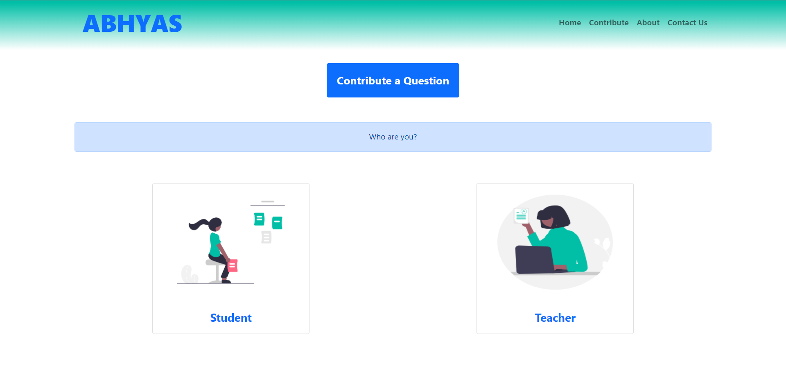
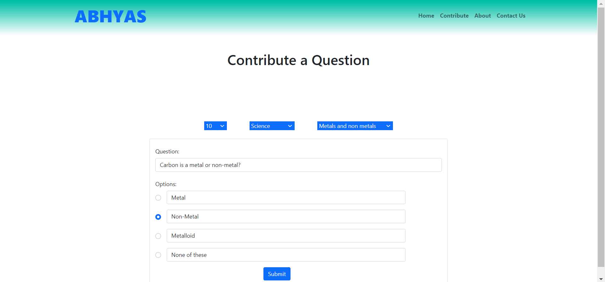
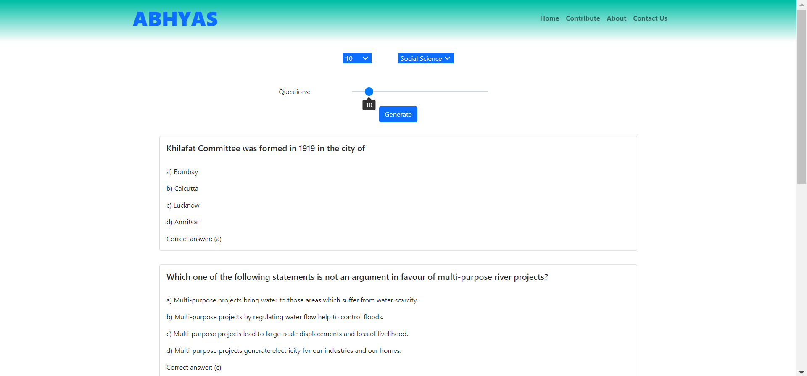

# Abhyas

A crowd sourcing model for generation of a large question bank. Volunteers can contribute questions to the database, which can then be used by teachers to generate question paper and by students to take up quizes.

---

### Tech stack used:
* JavaScript
* MongoDB
* Express
* React
* Node.js
* NPM Packages
---

## Development Setup

```sh
git clone https://github.com/tanishchugh01/Abhyas.git
cd Abhyas/frontend
npm i
cd Abhyas/backend
npm i
```

Run the app

```
npm run dev
```

---
## Screenshots




